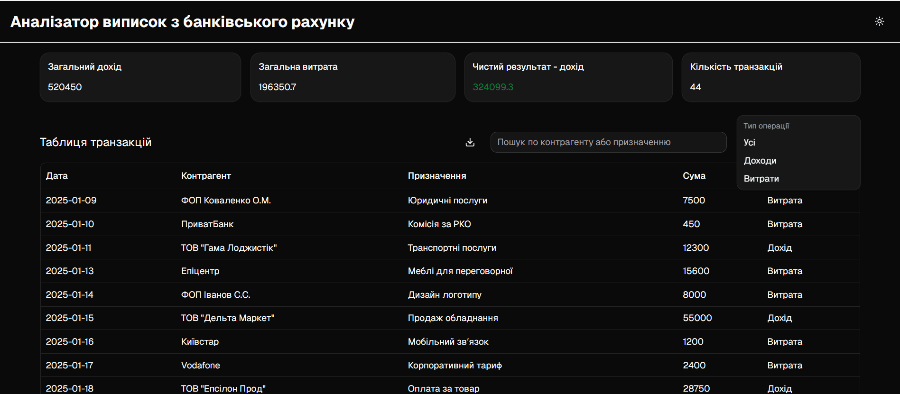

# Bank statement analyzer

[This is a bank statement analysis app.](https://bank-statement-analyzer-chi.vercel.app)

## Running the application locally

To run the application locally, run the following command:

```bash
npm install  
npm run dev
```

## Solution Description

This app was my first experience with shadcn/ui. 
It also took me a while to figure out the architecture and the unexpected theme change.

## Screenshot of the application screen
  

## Showing the application in action 
<video controls src="docs/showing-app-in-action.mp4" title="Showing the application in action"></video>
